<!--
  Repository settings (GitHub builds the search listing and link card from these, not from this file):
    About > Description: Local-first notes app for Android. Syncs to your own Google Drive, optional AES-256-GCM vault. No AI, no ads, no trackers.
    About > Website:     https://atomic-notes.devbehindyou.com
    About > Topics:      local-first, notes-app, android, flutter, dart, google-drive, end-to-end-encryption,
                         privacy, offline-first, no-tracking, aes-gcm, argon2, source-available
    Settings > Social preview: upload Project-Images/README/og-banner.png (1200x630)
-->

<div align="center">

<a href="https://github.com/DevBehindYou/Atomic-Notes-App-V0.2/releases/latest">
  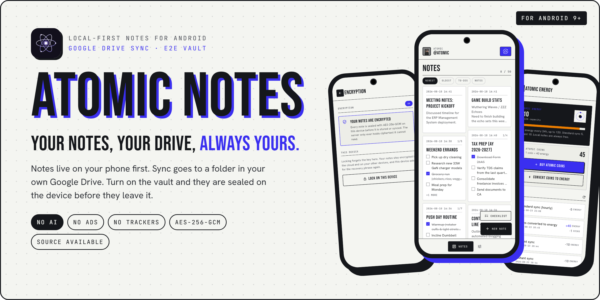
</a>

<h1>Atomic Notes</h1>

<p><b>Your Notes, Your Drive, Always Yours.</b></p>

<p>Local-first notes and checklists for Android. Sync to a folder in your own Google Drive.<br />
An optional end-to-end vault. No AI, no ads, no trackers.</p>

<p>
  <a href="https://github.com/DevBehindYou/Atomic-Notes-App-V0.2/releases/latest"></a>
  
  
  <a href="https://github.com/DevBehindYou/Atomic-Notes-App-V0.2/actions/workflows/flutter-ci.yml"></a>
  
  <a href="LICENSE"></a>
</p>

<p>
  <a href="https://github.com/DevBehindYou/Atomic-Notes-App-V0.2/releases/latest"><b>Download the APK</b></a>
  &nbsp;·&nbsp;
  <a href="https://atomic-notes.devbehindyou.com">Website</a>
  &nbsp;·&nbsp;
  <a href="#how-atomic-notes-works">How it works</a>
  &nbsp;·&nbsp;
  <a href="#faq">FAQ</a>
  &nbsp;·&nbsp;
  <a href="https://ko-fi.com/devbehindyou">Support</a>
</p>

</div>

---

## What is Atomic Notes?

**Atomic Notes is a free, source-available notes app for Android that keeps your notes on your phone first and syncs them to a private folder in your own Google Drive.** It has no AI features, no ads and no analytics. An optional vault encrypts every note on the device with AES-256-GCM, using a key derived from a 6-word recovery phrase, so the sync server and Google only ever store ciphertext. Version 2.03.5 shipped on 28 September 2026.

### At a glance

| | |
| :--- | :--- |
| **What it is** | A local-first app for text notes and checklists |
| **Platform** | Android 9 (API 28) or newer. APKs for `arm64-v8a`, `armeabi-v7a` and `x86_64` |
| **Latest version** | 2.03.5 (build 8), released 2026-09-28 on [GitHub Releases](https://github.com/DevBehindYou/Atomic-Notes-App-V0.2/releases/latest) |
| **Where notes live** | On the device first. When you sync, one file per note goes to a `My-Atomic-Notes` folder in your Google Drive |
| **Encryption** | Optional vault. Argon2id (64 MiB, 3 passes) turns a 6-word phrase into a key, then AES-256-GCM seals each note |
| **Sign-in** | Your Google account. The app asks for `drive.file`, so it can only see the files it created |
| **Price** | Free. Writing notes costs nothing. Cloud sync runs on Atomic Energy, which refills by 20 every 24 hours |
| **Tracking** | None. No analytics, no crash reporter, no ad SDK |
| **Source** | Public in this repository to read and verify. Proprietary, all rights reserved |

## Contents

- [Why it exists](#why-it-exists)
- [The problem: your notes became training data](#the-problem-your-notes-became-training-data)
- [Features](#features)
- [Screens](#screens)
- [How Atomic Notes works](#how-atomic-notes-works)
- [Security and privacy model](#security-and-privacy-model)
- [Performance](#performance)
- [Install and verify](#install-and-verify)
- [Verify the build yourself](#verify-the-build-yourself)
- [Tech stack](#tech-stack)
- [Roadmap](#roadmap)
- [FAQ](#faq)
- [Project documents](#project-documents)
- [Author and license](#author-and-license)
- [Support Atomic Notes](#support-atomic-notes)

---

## Why it exists

Atomic Notes has an origin story, and it's the reason it's built the way it is.

The developer used a mainstream notes app the way most people do. Ideas, mostly. Also a few account passwords and private notes he never should have typed there. Then one ordinary day the emails started. *"New sign-in from a location you don't usually use."* One account, then another. What followed was a frantic afternoon of password resets, token revocations and locked-out services.

The lesson wasn't "switch notes apps." It was this:

> **Stop using apps that take your data hostage and use it for their own private, profit-driven ends.**

So Atomic Notes became the app he wished he'd had. Your notes live on your device first. The cloud is an option you control, and it's your own Google Drive, not a server farm you'll never see. The business model can never be "mine the contents of your notes."

**The revival.** Atomic Notes was first built about three years ago. Back then, feasibility and tooling limits meant it couldn't launch the way it deserved, so it got shelved on purpose, with a note-to-self that one day the tech would catch up. It has. With modern tooling and an AI-assisted rebuild, the project is back: a new UI system, a rebuilt sync engine that writes to your Drive, a full performance pass, and a security-first foundation with an end-to-end vault.

---

## The problem: your notes became training data

The industry quietly changed the deal. Across mainstream productivity apps, "free" now tends to mean your content is the product. It gets read, profiled and, more and more often, fed into models as training data.

Two public examples show how fast terms can move under you. In August 2023, Zoom faced a backlash over terms that appeared to allow AI training on customer data, and it added a no-training-without-consent line within days ([TechCrunch](https://techcrunch.com/2023/08/08/zoom-data-mining-for-ai-terms-gdpr-eprivacy/)). In June 2024, Adobe's updated terms said it "may access your content through both automated and manual methods," and a user revolt made it rewrite them ([Adobe](https://blog.adobe.com/en/publish/2024/06/10/updating-adobes-terms-of-use)). Both companies walked the wording back. The lesson stands: the terms can change after you've written your notes.

Your notes are the most personal text you produce. Half-formed ideas, health details, passwords you shouldn't have put there, drafts you never meant anyone to read. That's not a corpus you should have to donate.

**Atomic Notes is designed to be structurally incapable of that model:**

| Most "free" notes apps | Atomic Notes |
| :--- | :--- |
| Content used to "improve services" and train AI | **No AI in the app. Your notes are never used for training.** |
| Analytics and crash SDKs profiling behavior | **Zero telemetry. No analytics, no crash reporters.** |
| Ad SDKs reading context to target you | **No ad SDKs in the app.** |
| Cloud-first, so your data lives on their servers by default | **Local-first. Your device holds the main copy, and sync goes to your own Google Drive.** |
| Your words sit readable on someone else's disk | **Turn on the vault and the server and Google only ever see ciphertext.** |
| Content monetized to fund "free" | **Funded by optional Atomic Coins that buy sync speed and note capacity, never access to your notes.** |

This isn't a posture bolted on afterward. It's why the app is local-first, why there's no AI, and why the money model sells convenience, never your content. You can check every claim in this table against the code in this repository. The dependency list is in [`pubspec.yaml`](pubspec.yaml).

---

## Features

### Notes and checklists that save as you type

Text notes and to-do checklists are the same kind of object, so they share one editor, one list and one limit. Every change is written to on-device storage (Hive) as you type. There's no "saving" spinner, and closing the app or losing signal can't lose your work.

- Pin notes to the top. Filter by Newest, Oldest, To-dos or Notes.
- Select several notes at once to delete them in one go.
- Deleted notes wait in a **Recycle Bin** until you restore them or delete them for good.
- Clean cards: each card shows only the title and the note. The date lives in the editor.

<div align="center">
<table>
  <tr>
    <td align="center" width="33%">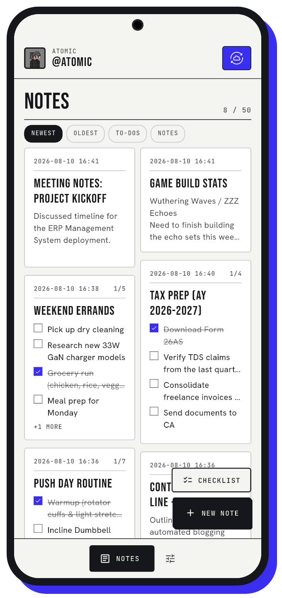<br /><sub><b>Notes grid</b></sub></td>
    <td align="center" width="33%">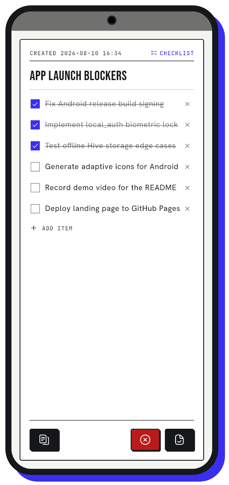<br /><sub><b>Checklist editor</b></sub></td>
    <td align="center" width="33%">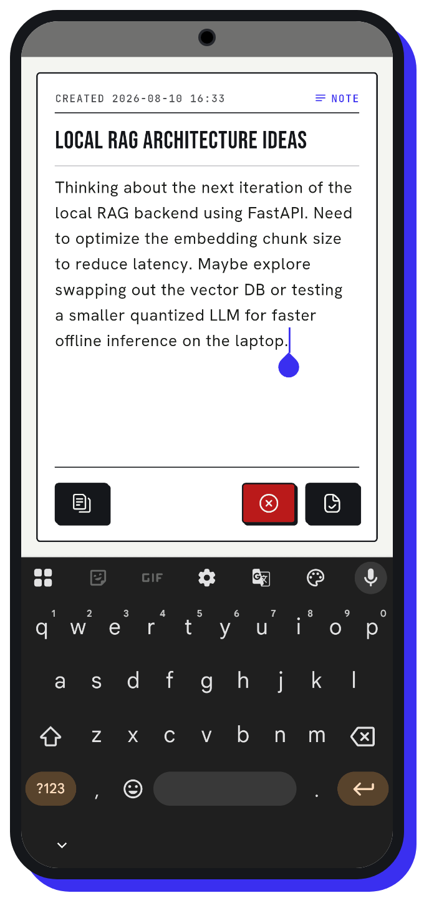<br /><sub><b>Text editor</b></sub></td>
  </tr>
</table>
</div>

### Sync to your own Google Drive

Atomic Notes doesn't keep your notes in its own database. When you sync, each note becomes one `.atomic` file in a `My-Atomic-Notes` folder in **your** Google Drive. The Atomic Notes server keeps only what sync needs to stay in order: note ids, pinned and deleted flags, timestamps and the Drive file id. Titles and text are never written to it.

- **Automatic sync** runs a few seconds after you stop typing, when you return to the app and when the network comes back. It runs at most once an hour. **Sync now** works any time.
- **Nothing gets lost to a bad connection.** A sync cut off by a closed app or a dropped network finishes on its own later, and you're never charged twice for it. A dropped connection is retried after 5, 15 and 45 seconds.
- **Edits on two devices don't overwrite each other.** If the same note changed on both, the app keeps your version as a "(conflict copy)" next to the other one.
- The app asks Google for `drive.file` only. That scope lets it see files it created, and nothing else in your Drive.

### An end-to-end vault, if you want one

The vault is off by default. Turn it on and the app shows you six words. Write them down. From those words, Argon2id (64 MiB of memory, 3 passes) derives a key on your phone, and every note is sealed with AES-256-GCM before it leaves the device. Your Drive and the Atomic Notes server then hold only ciphertext.

- **Lock on this device** forgets the key on that phone. Your notes stay encrypted in the cloud and on your other devices.
- A new phone asks for the six words once, then unlocks your notes.
- Notes written while the vault is off or locked are stored as plain text in your Drive. The app converts them to vault notes when you unlock.

### Atomic Energy and Atomic Coins

Writing notes is always free. **Atomic Energy** pays for cloud sync, and it refills on its own.

| Rule | Value |
| :--- | :--- |
| Free energy | +20 every 24 hours |
| Energy cap | 120 |
| Standard (automatic) sync | 5 energy, at most once an hour |
| Instant sync | 10 energy, any time |
| Sync with nothing to upload | Free |
| Welcome gift | 5 Atomic Coins |
| 1 Atomic Coin | 40 energy |

If a sync fails and no note gets through, its energy is refunded. Coins can't be bought in the app yet. Coin packs are the next phase on the [roadmap](#roadmap).

<div align="center">
<table>
  <tr>
    <td align="center" width="33%">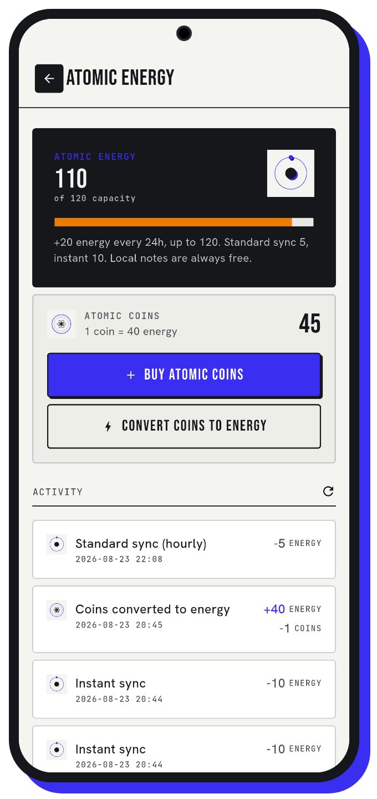<br /><sub><b>Atomic Energy</b></sub></td>
    <td align="center" width="33%">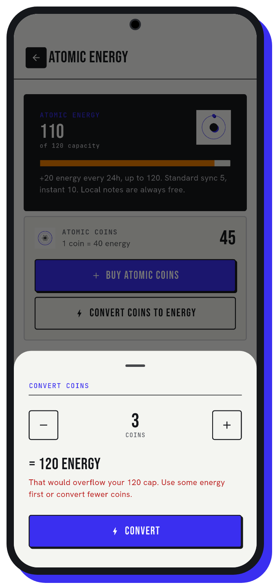<br /><sub><b>Convert coins</b></sub></td>
    <td align="center" width="33%">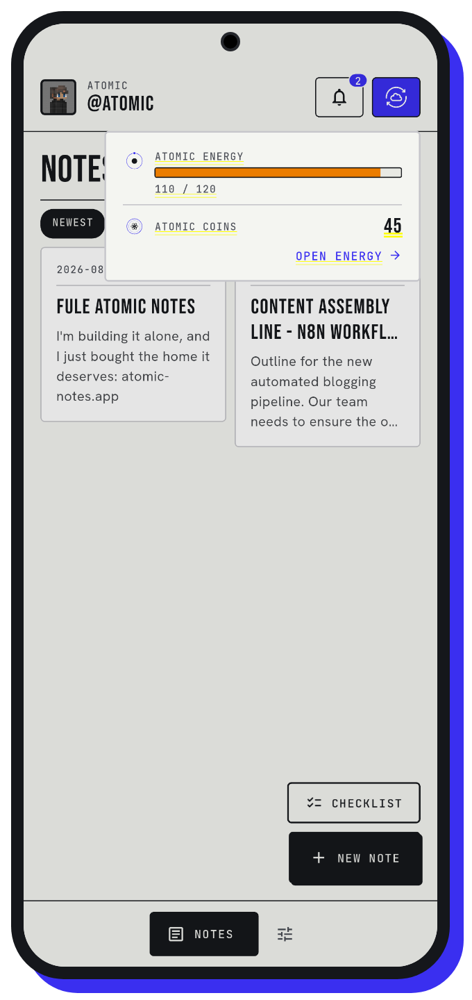<br /><sub><b>Quick look from home</b></sub></td>
  </tr>
</table>
</div>

### Note capacity tiers

Every account starts on **Tachyon** with room for 30 notes. Checklists count the same as notes. Moving up a tier is a one-time spend of coins. The Server enforces the limit as well as the app.

<div align="center">
  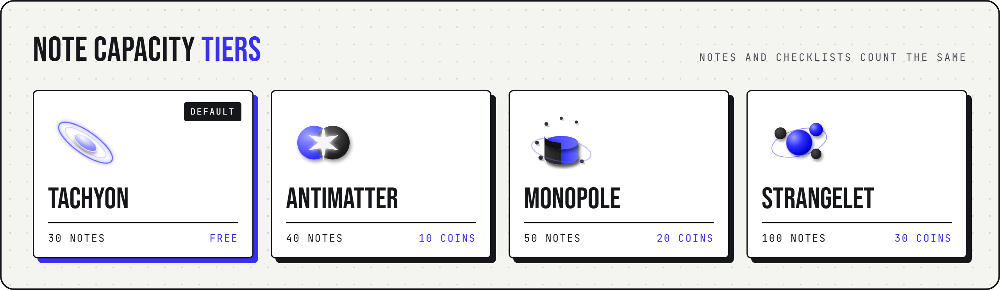
</div>

| Tier | Notes | Cost to reach it |
| :--- | ---: | :--- |
| Tachyon | 30 | Free, the starting tier |
| Antimatter | 40 | 10 coins |
| Monopole | 50 | 20 coins |
| Strangelet | 100 | 30 coins |

### Locks for the phone in your hand

- **Biometric lock.** Fingerprint or face unlock guards the app at launch, on top of your Google sign-in.
- **Two-step verification.** Scan a QR code into any authenticator app, and the app asks for a 6-digit code before it opens.
- **No screenshots.** The app blocks screenshots and screen recording of its own screens (Android `FLAG_SECURE`).
- Your session and vault key are kept in Android's secure storage, not in plain app files.

### A notification center, and Atomi

- The bell collects messages from the Atomic Notes team: new releases, maintenance and feature news. Tap a message to mark it read, or dismiss it. Pinned notices stay until they're resolved.
- **Atomi**, the dot-grid mascot on the home screen, tells you whether everything is synced and when the next automatic sync runs.

<div align="center">
<table>
  <tr>
    <td align="center" width="33%">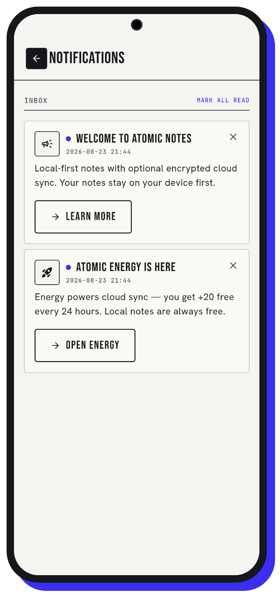<br /><sub><b>Notification center</b></sub></td>
    <td align="center" width="33%"><br /><sub><b>Atomi</b></sub></td>
    <td align="center" width="33%">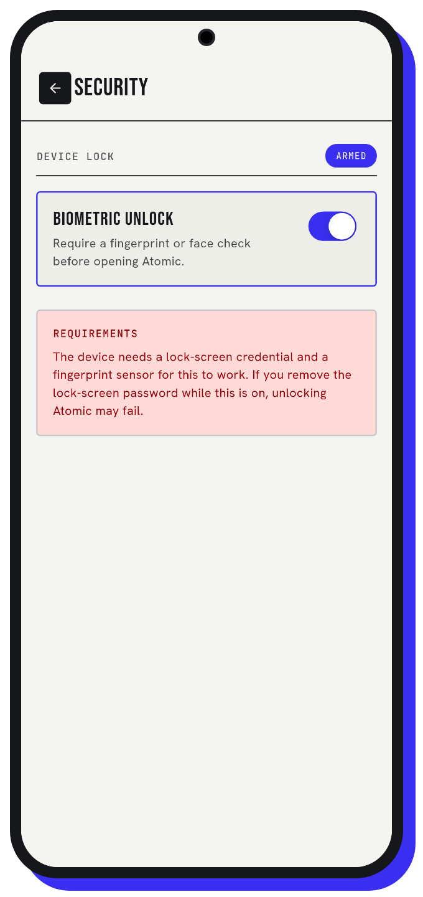<br /><sub><b>Biometric lock</b></sub></td>
  </tr>
</table>
</div>

### Your data, your switches

- **Cloud sync** can be turned off. Your notes then stay on the phone only.
- **Cloud notes** shows what is in your Drive and what is only on the device.
- **Danger Zone** wipes the notes on this device, or the copies in the cloud, separately. A cloud wipe doesn't touch the notes on your phone.
- Pick a profile picture from 14 pixel-art avatars. No photo upload needed.

---

## Screens

<div align="center">
<table>
  <tr>
    <td align="center" width="25%">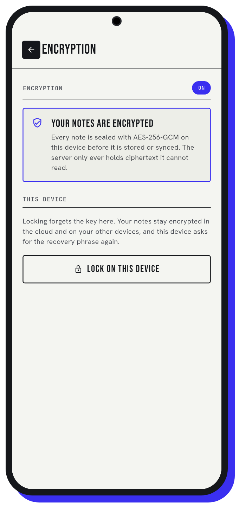<br /><sub><b>Encryption vault</b></sub></td>
    <td align="center" width="25%">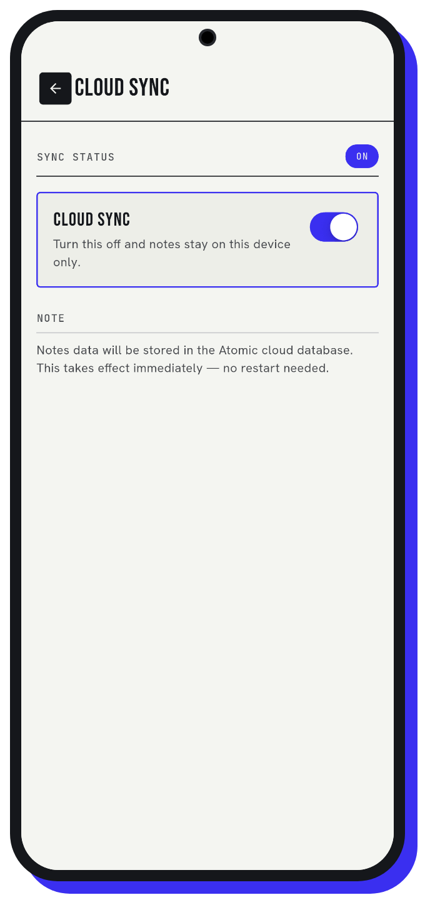<br /><sub><b>Cloud sync switch</b></sub></td>
    <td align="center" width="25%">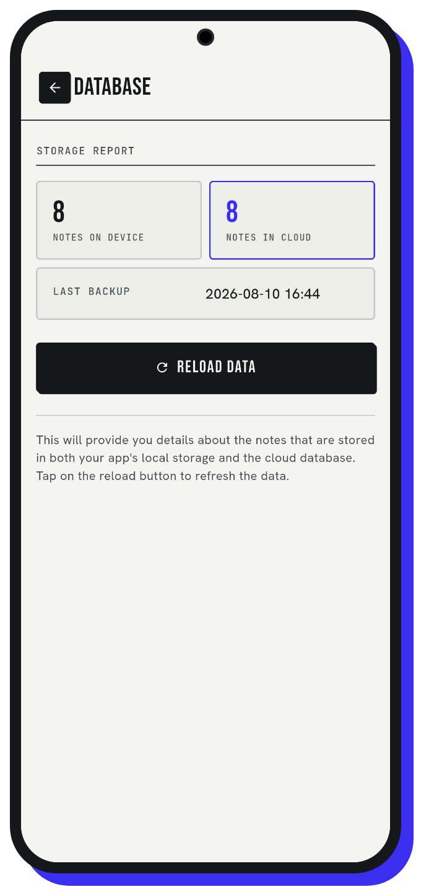<br /><sub><b>Device and cloud counts</b></sub></td>
    <td align="center" width="25%">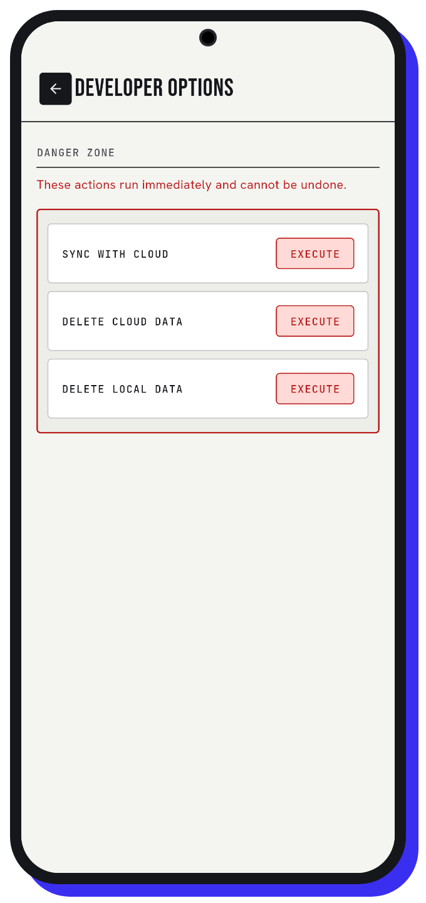<br /><sub><b>Danger Zone</b></sub></td>
  </tr>
</table>
</div>

The screens use the **Technical Editorial** design system: ink `#15171B` on paper `#F4F5F1`, with one accent, Signal `#3A2FF0`. Headings are Bebas Neue, body text is Hanken Grotesk and data is JetBrains Mono. The fonts ship inside the app, so it looks right with no network. Some screenshots come from the August 2026 build, so small details (like the dates on note cards) differ from the current version.

---

## How Atomic Notes works

The phone is the source of truth. The server is a thin coordinator that checks your energy, keeps the sync order and writes files to **your** Drive. It never stores note text.

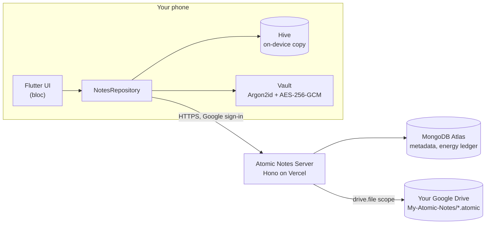

**One sync, step by step:**

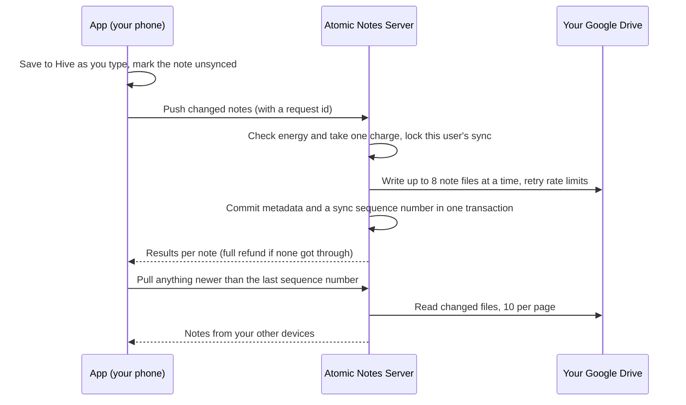

If the app dies between "push" and "results", the next launch sends the same request id. The server replays the stored result instead of charging again.

### What each party can see

| | Vault off | Vault on |
| :--- | :--- | :--- |
| **Your phone** | Everything | Everything, after unlock |
| **Your Google Drive** | Note titles and text | Ciphertext only |
| **Atomic Notes server** | Passes note text through to Drive in transit. Stores metadata only | Ciphertext in transit. Stores metadata only |
| **Atomic Notes team** | No access to your Drive files | No access, and no key |

---

## Security and privacy model

What protects your notes today, stated exactly:

- **In transit:** every call to the server uses HTTPS.
- **At rest in the cloud:** notes sit in your own Google Drive under your Google account's security. With the vault on, they're AES-256-GCM ciphertext there too.
- **Key handling:** the vault key comes from your six words through Argon2id on the phone. The words and the key never leave the device. Lose the words, and no one can recover vault notes. That's the point of end-to-end encryption.
- **Least privilege:** the `drive.file` scope limits the app to files it made. Server-side Google tokens are encrypted before they're stored.
- **On the device:** biometric lock, two-step verification, blocked screenshots and secure storage for secrets.
- **No telemetry:** no analytics, crash reporting or ad SDKs in [`pubspec.yaml`](pubspec.yaml). No AI feature exists to send notes to.

What isn't protected, so you can decide for yourself:

- With the vault **off**, your notes are plain text in your Drive, and they pass through the server as plain text on the way there.
- Hive storage on the phone isn't encrypted by the app. It relies on Android's own device encryption.
- The Google OAuth consent screen is still in testing, so Google limits sign-in to test users. Publishing it is on the [roadmap](#roadmap).

The full plain-language disclosure is in [TRANSPARENCY.md](TRANSPARENCY.md).

---

## Performance

Measured on a real Android phone against production on 27 September 2026 (server time, single samples):

| Operation | Time |
| :--- | ---: |
| Push 9 notes to Drive | 3.2 s |
| Push 22 notes to Drive (8 files in flight) | 6.8 s |
| Push 1 note | 1.6 s |
| App cold start after a force stop | 0.5 to 0.9 s |
| First launch after install | 3.4 s |

Most of a push is Google Drive's own write time, about 1.5 s per file. The server writes eight files at a time, which cut a push of about 22 notes from 8.9 s to 6.8 s.

---

## Install and verify

1. Open the [latest release](https://github.com/DevBehindYou/Atomic-Notes-App-V0.2/releases/latest).
2. Download the APK for your phone. Most phones need the file ending in **`arm64-v8a.apk`**. Older 32-bit phones need `armeabi-v7a`, and emulators need `x86_64`.
3. Open the file and allow installs from your browser or file manager when Android asks.

Version 2.03.5 installs over 2.03.4 and 1.18.2 and keeps your notes. Both use the same package name (`com.notes.atomic`) and the same signing key.

**Check the signature before you install.** Every release is signed with the Atomic Notes release key:

```text
Certificate SHA-256: cc24ae5ce1dca50fcd5e5c4c252d69e4965c55a975bd0e4739e8938fad9bebeb
Certificate SHA-1:   20:08:8F:BF:45:D7:D1:5A:4C:26:69:D6:47:84:16:E2:7F:32:85:45
```

```bash
apksigner verify --print-certs atomic-notes-2.03.5-arm64-v8a.apk
```

Each release page also lists the SHA-256 of every APK file and the GitHub Actions run that built it.

---

## Verify the build yourself

The release APKs are built by GitHub Actions ([`release-android.yml`](.github/workflows/release-android.yml)) with Flutter 3.44.8, from the commit named on each release page. The [license](LICENSE) lets you build the app on your own machine to check it against the published source and the official release:

```bash
git clone https://github.com/DevBehindYou/Atomic-Notes-App-V0.2.git
cd Atomic-Notes-App-V0.2
cp lib/authentication/auth_services/cred.example.dart lib/authentication/auth_services/cred.dart
flutter pub get
flutter test
flutter build apk --release --split-per-abi
```

A build you sign yourself can't sign in with Google, because the sign-in client is tied to the release signing key. Use it to read, test and compare. You may not install it for others, share it or publish it. [CI.md](CI.md) covers the workflows and [TESTING.md](TESTING.md) covers the test suites.

---

## Tech stack

| Layer | Technology |
| :--- | :--- |
| App | Flutter 3.44.8, Dart 3, `bloc` / `flutter_bloc` for state |
| Local storage | Hive CE (`hive_ce`, `hive_ce_flutter`) |
| Sign-in | `google_sign_in` with the `openid`, `email`, `profile` and `drive.file` scopes |
| Encryption | `cryptography` (Argon2id, AES-256-GCM), `flutter_secure_storage` |
| Device security | `local_auth` (biometrics), TOTP two-step codes, `FLAG_SECURE` |
| Server | Hono (TypeScript) on Vercel, MongoDB Atlas, Google Drive API |
| Website | Next.js 15 ([Atomic Notes Community](https://atomic-notes.devbehindyou.com)) |
| Releases | GitHub Actions, split-ABI APKs signed with the release key |

---

## Roadmap

*Updated 28 September 2026.*

- [x] Local-first notes and checklists, offline by default
- [x] Sync to the user's own Google Drive, with replay-safe pushes
- [x] End-to-end vault (6-word phrase, Argon2id, AES-256-GCM)
- [x] Atomic Energy, Atomic Coins and note capacity tiers
- [x] Notification center and team announcements
- [x] Biometric lock, two-step verification and blocked screenshots
- [x] Buttons in notifications that open web links
- [ ] Publish the Google OAuth consent screen, so anyone can sign in
- [ ] Coin packs you can buy, for faster sync and more notes
- [ ] Background sync while the app is closed
- [ ] iOS build

> **Not on the roadmap:** AI features and paid subscriptions. Both were considered and rejected. They pull the app toward the data-hungry model Atomic Notes exists to avoid.

---

## FAQ

### Is Atomic Notes free?

Yes. Writing and keeping notes on your phone is free with no limit on time, and every account can hold 30 notes at no cost. Cloud sync uses Atomic Energy, which refills by 20 every 24 hours. That covers four standard syncs a day. Atomic Coins add more energy or note capacity. There are no subscriptions.

### Where does Atomic Notes store my notes?

On your phone first, in on-device Hive storage. When you sync, each note is saved as its own `.atomic` file in a `My-Atomic-Notes` folder in your Google Drive. The Atomic Notes server stores only metadata such as note ids, timestamps and flags. It never stores your note titles or text.

### Can the developer read my notes?

Not with the vault on. The vault encrypts each note on your phone with AES-256-GCM before it's uploaded, so your Drive and the server hold only ciphertext, and the key never leaves your device. With the vault off, notes are plain text in your own Drive, and they pass through the server on the way there.

### Does Atomic Notes use AI or train models on my notes?

No. Atomic Notes has no AI features, and your notes are never sent to a model or used as training data. The app ships no analytics, crash-reporting or advertising SDKs. You can check this in the public source code and in the dependency list in `pubspec.yaml`, which is the full list of libraries the app uses.

### Does Atomic Notes work offline?

Yes. The app opens and saves notes the same way with or without a connection, because the phone holds the main copy. Changes made offline sync on their own when the network comes back. You need a connection only for the first Google sign-in and for syncing to Drive.

### What happens if I lose my 6-word recovery phrase?

Notes on a phone that is still unlocked stay readable there. But no one, including the developer, can decrypt your vault notes on a new device without the six words, because the key is derived from them on your phone and never uploaded. Write the phrase down on paper and keep it somewhere safe.

### Is Atomic Notes on Google Play or iOS?

Not yet. Atomic Notes for Android ships as signed APKs on GitHub Releases, and you can check each file's certificate and SHA-256 before installing. An iOS build is on the roadmap.

---

## Project documents

| Document | What it covers |
| :--- | :--- |
| [TRANSPARENCY.md](TRANSPARENCY.md) | What the app collects, where notes live and what is protected |
| [DESIGN-NOTES.md](DESIGN-NOTES.md) | The Technical Editorial design system |
| [STATE-MANAGEMENT.md](STATE-MANAGEMENT.md) | How bloc and cubits drive the screens |
| [TESTING.md](TESTING.md) | Unit, widget and bloc tests |
| [CI.md](CI.md) | The CI and release workflows |
| [PROGRESS.md](PROGRESS.md) | Build history and version notes |

---

## Author and license

Built by **DevBehindYou** (Ashutosh Sharma), who also runs the sync server and the community site.

- Portfolio: [devbehindyou.vercel.app](https://devbehindyou.vercel.app)
- GitHub: [@DevBehindYou](https://github.com/DevBehindYou)
- Medium: [@devbehindyou](https://medium.com/@devbehindyou)
- X: [@devbehindyou](https://x.com/devbehindyou)

Atomic Notes is proprietary, **source-available** software. The code is public so you can check how the app treats your data, and you can install the official releases. You may not copy, modify, redistribute or reuse the code, or use it to train AI models. The full terms are in the [Atomic Notes Source-Available License](LICENSE). Versions published before 28 September 2026 were released under the MIT License.

<div align="center">
  <br />
  
  <br />
  <sub><b>ATOMIC NOTES</b> · Your Notes, Your Drive, Local First.</sub>
</div>

---

## Support Atomic Notes

Atomic Notes is built and run by one developer. If the app is useful to you, you can support it on Patreon or Ko-fi at the amount you choose. Both reach the same developer.

<p>
  <a href="https://www.patreon.com/cw/DevBehindYou"></a>
  <a href="https://ko-fi.com/devbehindyou"></a>
</p>

- Patreon: [patreon.com/cw/DevBehindYou](https://www.patreon.com/cw/DevBehindYou)
- Ko-fi: [ko-fi.com/devbehindyou](https://ko-fi.com/devbehindyou)

Early supporters get Atomic Coins as a thank-you. Send your Atomic Notes account email in a Patreon message, or write it in the Ko-fi message box and mark it private, and the developer adds the coins to your account by hand. Patreon or Ko-fi handles the payment, so Atomic Notes never sees your card or bank details. The full steps are on the [support page](https://atomic-notes.devbehindyou.com/support-atomic-notes).
